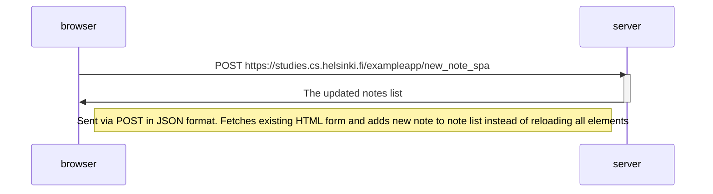

```mermaid
sequenceDiagram
  participant browser
  participant server

  browser->>server: POST https://studies.cs.helsinki.fi/exampleapp/new_note_spa
  activate server
  server->>browser: The updated notes list
  deactivate server

  Note right of browser: Sent via POST in JSON format. Fetches existing HTML form and adds new note to note list instead of reloading all elements
```
